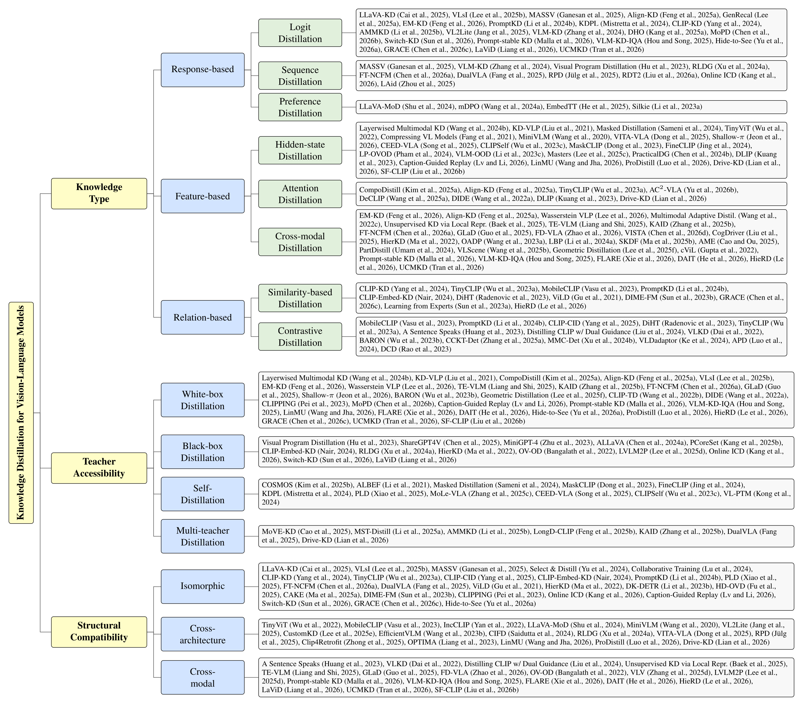
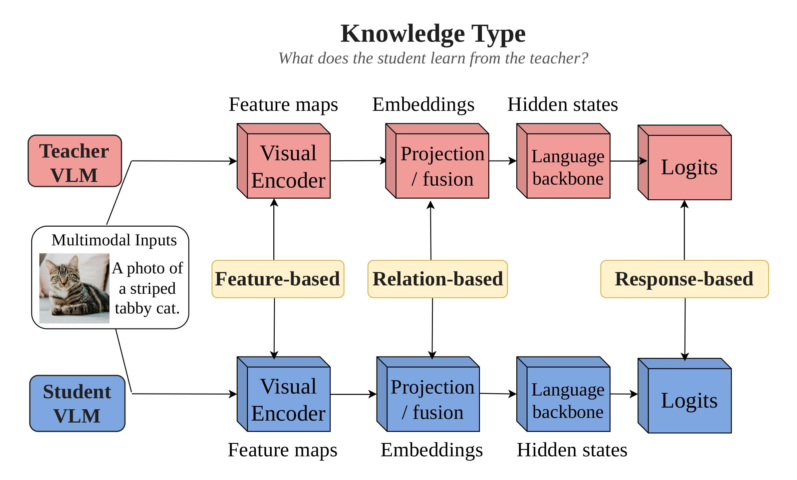
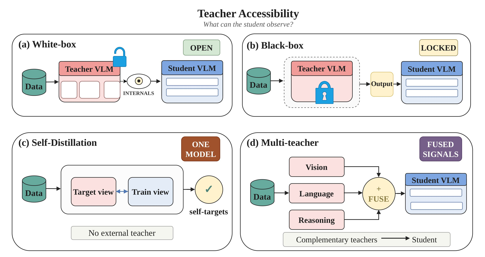
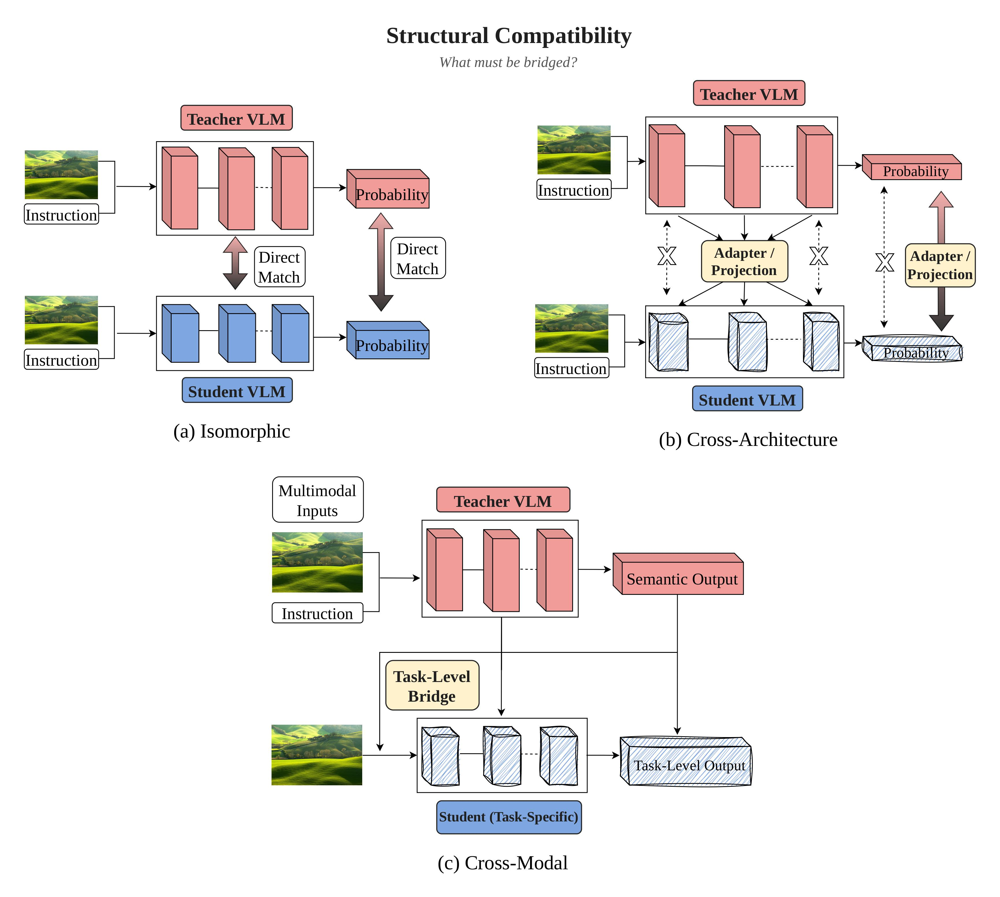

## A Survey on Knowledge Distillation of Vision-Language Models

## 🔔 News

- **[21/08/2026]** 🎉 This survey has been accepted by the Conference on Empirical Methods in Natural Language Processing (EMNLP) 2026!

## 📝 Introduction

This paper provides **the first dedicated survey of knowledge distillation for vision-language models**. We propose a unified taxonomy that organizes methods along three orthogonal views: knowledge type, teacher accessibility, and structural compatibility, and use it to organize methods across major VLM distillation settings.

## 📊 Taxonomy

Below is the taxonomy summarizing the landscape of knowledge distillation research for VLMs:

This survey organizes VLM distillation methods along three **orthogonal** axes. Each axis is illustrated below, immediately before the corresponding paper sections.

| Axis | Question | Sections |
|---|---|---|
| **Knowledge Type** | What does the student learn from the teacher? | [I](#section-i-response-based-distillation) · [II](#section-ii-feature-based-distillation) · [III](#section-iii-relation-based-distillation) |
| **Teacher Accessibility** | What can the student observe about the teacher? | [IV](#section-iv-white-box-distillation) · [V](#section-v-black-box-distillation) · [VI](#section-vi-self-distillation) · [VII](#section-vii-multi-teacher-distillation) |
| **Structural Compatibility** | What must be bridged before distillation can proceed? | [VIII](#section-viii-structural-compatibility---isomorphic) · [IX](#section-ix-structural-compatibility---cross-architecture) · [X](#section-x-structural-compatibility---cross-modal) |

| Application | Section |
|---|---|
| Vision-Language-Action | [VLA](#knowledge-distillation-for-vision-language-action-models) |
| Vision-Language Embedding | [Embedding](#knowledge-distillation-for-vision-language-embedding-models) |
| Semantic Segmentation | [Segmentation](#vlm-knowledge-distillation-for-segmentation) |
| Open-Vocabulary Object Detection | [OVD](#vlm-knowledge-distillation-for-open-vocabulary-object-detection) |

## Knowledge Type

  

| Branch | Section |
|---|---|
| Response-based Distillation | [Section I](#section-i-response-based-distillation) |
| Feature-based Distillation | [Section II](#section-ii-feature-based-distillation) |
| Relation-based Distillation | [Section III](#section-iii-relation-based-distillation) |

## Section I: Response-based Distillation

**Logit Distillation**

* LLaVA-KD: A Framework of Distilling Multimodal Large Language Models [[Paper]](https://openaccess.thecvf.com/content/ICCV2025/papers/Cai_LLaVA-KD_A_Framework_of_Distilling_Multimodal_Large_Language_Models_ICCV_2025_paper.pdf) 
* VLsI: Verbalized Layers-to-Interactions from Large to Small Vision Language Models [[Paper]](https://arxiv.org/abs/2412.01822) 
* MASSV: Multimodal Adaptation and Self-Data Distillation for Speculative Decoding of Vision-Language Models [[Paper]](https://arxiv.org/abs/2505.10526) 
* Align-KD: Distilling Cross-Modal Alignment Knowledge for Mobile Vision-Language Model [[Paper]](https://openreview.net/pdf?id=xsCK546dra) 
* GenRecal: Generation after Recalibration from Large to Small Vision-Language Models [[Paper]](https://arxiv.org/pdf/2506.15681) 
* EM-KD: Distilling Efficient Multimodal Large Language Model with Unbalanced Vision Tokens [[Paper]](https://arxiv.org/pdf/2511.21106) 
* PromptKD: Unsupervised Prompt Distillation for Vision-Language Models [[Paper]](https://openaccess.thecvf.com/content/CVPR2024/papers/Li_PromptKD_Unsupervised_Prompt_Distillation_for_Vision-Language_Models_CVPR_2024_paper.pdf) 
* Improving Zero-Shot Generalization of Learned Prompts via Unsupervised Knowledge Distillation [[Paper]](https://arxiv.org/abs/2407.03056) 
* CLIP-KD: An Empirical Study of CLIP Model Distillation [[Paper]](https://arxiv.org/abs/2307.12732) 
* AMMKD: Adaptive Multimodal Multi-Teacher Distillation for Lightweight Vision-Language Models [[Paper]](https://arxiv.org/abs/2509.00039) 
* VL2Lite: Task-Specific Knowledge Distillation from Large Vision-Language Models to Lightweight Networks [[Paper]](https://openaccess.thecvf.com/content/CVPR2025/papers/Jang_VL2Lite_Task-Specific_Knowledge_Distillation_from_Large_Vision-Language_Models_to_Lightweight_CVPR_2025_paper.pdf) 
* VLM-KD: Knowledge Distillation from VLM for Long-Tail Visual Recognition [[Paper]](https://arxiv.org/abs/2408.16930) 
* DHO: Simple yet Effective Semi-supervised Knowledge Distillation from Vision-Language Models via Dual-Head Optimization [[Paper]](https://arxiv.org/abs/2505.07675) 
* MoPD: Mixture-of-Prompts Distillation for Vision-Language Models [[Paper]](https://doi.org/10.1109/TMM.2025.3645615) 
* Switch-KD: Visual-Switch KD for Vision-Language Models [[Paper]](https://arxiv.org/abs/2604.14629) 
* Prompt-stable knowledge distillation of vision-language models for efficient waste classification in material recovery facilities [[Paper]](https://www.sciencedirect.com/science/article/pii/S0921344926001096) 
* Visual-Language Model Knowledge Distillation Method for Image Quality Assessment [[Paper]](https://arxiv.org/abs/2507.15680) 
* Hide to See: Reasoning-prefix Masking for Visual-anchored Thinking in VLM Distillation [[Paper]](https://arxiv.org/abs/2605.11651) 
* Gated Relational Alignment via Confidence-based Distillation for Efficient VLMs [[Paper]](https://arxiv.org/abs/2601.22709) 
* Large Language Model Teaches Visual Students: Cross-Modality Transfer of Fine-Grained Conceptual Knowledge [[Paper]](https://icml.cc/virtual/2026/poster/66244) 
* Cross-Modal Knowledge Distillation without Paired Data: Theoretical Foundation and Algorithm [[Paper]](https://icml.cc/virtual/2026/poster/60546) 

**Sequence Distillation**

* MASSV: Multimodal Adaptation and Self-Data Distillation for Speculative Decoding of Vision-Language Models [[Paper]](https://arxiv.org/abs/2505.10526) 
* VLM-KD: Knowledge Distillation from VLM for Long-Tail Visual Recognition [[Paper]](https://arxiv.org/abs/2408.16930) 
* Visual Program Distillation: Distilling Tools and Programmatic Reasoning into Vision-Language Models [[Paper]](https://arxiv.org/abs/2312.03052) 
* RLDG: Robotic Generalist Policy Distillation via Reinforcement Learning [[Paper]](https://arxiv.org/abs/2412.09858) 
* FT-NCFM: An Influence-Aware Data Distillation Framework for Efficient VLA Models [[Paper]](https://arxiv.org/abs/2511.16233) 
* DualVLA: Building a Generalizable Embodied Agent via Partial Decoupling of Reasoning and Action [[Paper]](https://arxiv.org/abs/2511.22134) 
* Refined Policy Distillation: From VLA Generalists to RL Experts [[Paper]](https://arxiv.org/abs/2503.05833) 
* RDT2: Exploring the Scaling Limit of UMI Data Towards Zero-Shot Cross-Embodiment Generalization [[Paper]](https://arxiv.org/abs/2602.03310) 
* Online In-Context Distillation for Low-Resource Vision Language Models [[Paper]](https://arxiv.org/abs/2510.18117) 
* Towards Long-window Anchoring in Vision-Language Model Distillation [[Paper]](https://arxiv.org/abs/2512.21576) 

**Preference Distillation**

* LLaVA-MoD: Making LLaVA Tiny via MoE Knowledge Distillation [[Paper]](https://arxiv.org/abs/2408.15881) 
* mDPO: Conditional Preference Optimization for Multimodal Large Language Models [[Paper]](https://aclanthology.org/2024.emnlp-main.460/) 
* Embedding the Teacher: Distilling vLLM Preferences for Scalable Image Retrieval [[Paper]](https://arxiv.org/abs/2510.12014) 
* Silkie: Preference Distillation for Large Visual Language Models [[Paper]](https://arxiv.org/abs/2312.10665) 

## Section II: Feature-based Distillation

**Hidden-state Distillation**

* Layerwised Multimodal Knowledge Distillation for Vision-Language Pretrained Model [[Paper]](https://www.sciencedirect.com/science/article/abs/pii/S0893608024001965) 
* KD-VLP: Improving End-to-End Vision-and-Language Pretraining with Object Knowledge Distillation [[Paper]](https://arxiv.org/abs/2109.10504) 
* Building Vision-Language Models on Solid Foundations with Masked Distillation [[Paper]](https://openaccess.thecvf.com/content/CVPR2024/papers/Sameni_Building_Vision-Language_Models_on_Solid_Foundations_with_Masked_Distillation_CVPR_2024_paper.pdf) 
* TinyViT: Fast Pretraining Distillation for Small Vision Transformers [[Paper]](https://arxiv.org/abs/2207.10666) 
* Compressing Visual-Linguistic Model via Knowledge Distillation [[Paper]](https://arxiv.org/abs/2104.02096) 
* MiniVLM: A Smaller and Faster Vision-Language Model [[Paper]](https://arxiv.org/abs/2012.06946) 
* VITA-VLA: Efficiently Teaching Vision-Language Models to Act via Action Expert Distillation [[Paper]](https://arxiv.org/abs/2510.09607) 
* Shallow-pi: Knowledge Distillation for Flow-based VLAs [[Paper]](https://arxiv.org/abs/2601.20262) 
* CEED-VLA: Consistency Vision-Language-Action Model with Early-Exit Decoding [[Paper]](https://arxiv.org/abs/2506.13725) 
* CLIPSelf: Vision Transformer Distills Itself for Open-Vocabulary Dense Prediction [[Paper]](https://arxiv.org/abs/2310.01403) 
* MaskCLIP: Masked Self-Distillation Advances Contrastive Language-Image Pretraining [[Paper]](https://openaccess.thecvf.com/content/CVPR2023/papers/Dong_MaskCLIP_Masked_Self-Distillation_Advances_Contrastive_Language-Image_Pretraining_CVPR_2023_paper.pdf) 
* FineCLIP: Self-distilled Region-based CLIP for Better Fine-grained Understanding [[Paper]](https://proceedings.neurips.cc/paper_files/paper/2024/file/3122aaa22b2fe83f9cead1a696f65ceb-Paper-Conference.pdf) 
* LP-OVOD: Open-Vocabulary Object Detection by Linear Probing [[Paper]](https://arxiv.org/abs/2310.17109) 
* Distilling Large Vision-Language Model with Out-of-Distribution Generalizability [[Paper]](https://openaccess.thecvf.com/content/ICCV2023/papers/Li_Distilling_Large_Vision-Language_Model_with_Out-of-Distribution_Generalizability_ICCV_2023_paper.pdf) 
* Masking Teacher and Reinforcing Student for Distilling Vision-Language Models [[Paper]](https://arxiv.org/abs/2512.22238) 
* PracticalDG: Perturbation Distillation on Vision-Language Models for Hybrid Domain Generalization [[Paper]](https://arxiv.org/abs/2404.09011) 
* DLIP: Distilling Language-Image Pre-training [[Paper]](https://arxiv.org/abs/2308.12956) 
* Distilling Knowledge from Caption-Guided Replay for VLM-Based Continual Learning [[Paper]](https://openreview.net/forum?id=HN18kuyf4o) 
* LinMU: Multimodal Understanding Made Linear [[Paper]](https://arxiv.org/pdf/2601.01322) 
* Prodistill: A Progressive Prompting Framework for Fine-Grained VLM Distillation [[Paper]](https://ieeexplore.ieee.org/document/11461281/) 
* Drive-KD: Multi-Teacher Distillation for VLMs in Autonomous Driving [[Paper]](https://arxiv.org/abs/2601.21288) 
* SF-CLIP: CLIP-based Arbitrary Style Image Retrieval with Style and Fine-Grained Semantic Enhancement [[Paper]](https://doi.org/10.1109/ICASSP55912.2026.11461615) 

**Attention Distillation**

* CompoDistill: Attention Distillation for Compositional Reasoning in Multimodal LLMs [[Paper]](https://arxiv.org/abs/2510.12184) 
* Align-KD: Distilling Cross-Modal Alignment Knowledge for Mobile Vision-Language Model [[Paper]](https://openreview.net/pdf?id=xsCK546dra) 
* TinyCLIP: CLIP Distillation via Affinity Mimicking and Weight Inheritance [[Paper]](https://arxiv.org/abs/2309.12314) 
* AC^2-VLA: Action-Context-Aware Adaptive Computation in Vision-Language-Action Models for Efficient Robotic Manipulation [[Paper]](https://arxiv.org/abs/2601.19634) 
* DeCLIP: Decoupled Learning for Open-Vocabulary Dense Perception [[Paper]](https://arxiv.org/abs/2505.04410) 
* DIDE: Distilled Dual-Encoder Model for Vision-Language Understanding [[Paper]](https://doi.org/10.18653/v1/2022.emnlp-main.608) 
* DLIP: Distilling Language-Image Pre-training [[Paper]](https://arxiv.org/abs/2308.12956) 
* Drive-KD: Multi-Teacher Distillation for VLMs in Autonomous Driving [[Paper]](https://arxiv.org/abs/2601.21288) 

**Cross-modal Feature Distillation**

* EM-KD: Distilling Efficient Multimodal Large Language Model with Unbalanced Vision Tokens [[Paper]](https://arxiv.org/pdf/2511.21106) 
* Align-KD: Distilling Cross-Modal Alignment Knowledge for Mobile Vision-Language Model [[Paper]](https://openreview.net/pdf?id=xsCK546dra) 
* Modality-specific Knowledge Distillation with Wasserstein Distance Minimization for Vision-Language Pretrained Models [[Paper]](https://ieeexplore.ieee.org/document/11178237) 
* Multimodal Adaptive Distillation for Leveraging Unimodal Encoders for Vision-Language Tasks [[Paper]](https://arxiv.org/abs/2204.10496) 
* Unsupervised Knowledge Distillation via Local Representations for Vision-Language Models [[Paper]](https://ieeexplore.ieee.org/document/11048580) 
* TE-VLM: Transfer Entropy for Vision Language Model Distillation [[Paper]](https://openreview.net/forum?id=vJV22Ig8YG) 
* KAID: Knowledge-Aware Interactive Distillation for Vision-Language Models [[Paper]](https://www.semanticscholar.org/paper/KAID%3A-Knowledge-Aware-Interactive-Distillation-for-Zhang-Wang/30af36e012240ef4402b57230c109900f49f7102) 
* FT-NCFM: An Influence-Aware Data Distillation Framework for Efficient VLA Models [[Paper]](https://arxiv.org/abs/2511.16233) 
* GLaD: Geometric Latent Distillation for Vision-Language-Action Models [[Paper]](https://arxiv.org/abs/2512.09619) 
* FD-VLA: Force-Distilled Vision-Language-Action Model for Contact-Rich Manipulation [[Paper]](https://arxiv.org/abs/2602.02142) 
* VISTA: Enhancing Visual Conditioning via Track-Following Preference Optimization in Vision-Language-Action Models [[Paper]](https://arxiv.org/abs/2602.05049) 
* OmniReason: A Temporal-Guided Vision-Language-Action Framework for Autonomous Driving [[Paper]](https://arxiv.org/abs/2509.00789) 
* Open-Vocabulary One-Stage Detection with Hierarchical Visual-Language Knowledge Distillation [[Paper]](https://arxiv.org/abs/2203.10593) 
* Object-Aware Distillation Pyramid for Open-Vocabulary Object Detection [[Paper]](https://arxiv.org/abs/2303.05892) 
* Learning Background Prompts to Discover Implicit Knowledge for Open Vocabulary Object Detection [[Paper]](https://arxiv.org/abs/2406.00510) 
* SKDF: A Simple Knowledge Distillation Framework for Distilling Open-Vocabulary Knowledge to Open-World Object Detector [[Paper]](https://arxiv.org/abs/2312.08653) 
* AME: Aligned Manifold Entropy for Robust Vision-Language Distillation [[Paper]](https://arxiv.org/abs/2508.08644) 
* PartDistill: 3D Shape Part Segmentation by Vision-Language Model Distillation [[Paper]](https://arxiv.org/abs/2312.04016) 
* VLScene: Vision-language guidance distillation for camera-based 3D semantic scene completion [[Paper]](https://arxiv.org/abs/2503.06219) 
* 3D-aware vision-language models fine-tuning with geometric distillation [[Paper]](https://arxiv.org/abs/2506.09883) 
* cViL: Cross-Lingual Training of Vision-Language Models using Knowledge Distillation [[Paper]](https://doi.org/10.1109/ICPR56361.2022.9956259) 
* Prompt-stable knowledge distillation of vision-language models for efficient waste classification in material recovery facilities [[Paper]](https://www.sciencedirect.com/science/article/pii/S0921344926001096) 
* Visual-Language Model Knowledge Distillation Method for Image Quality Assessment [[Paper]](https://arxiv.org/abs/2507.15680) 
* FLARE: Learning Future-Aware Latent Representations from Vision-Language Models for Autonomous Driving [[Paper]](https://arxiv.org/abs/2601.05611) 
* DAIT: Distillation from Vision-Language Models to Lightweight Classifiers with Adaptive Intermediate Teacher Transfer [[Paper]](https://arxiv.org/pdf/2603.15166) 
* HieRD: Hierarchical Relational Distillation for Vision-Language Embedding Models [[Paper]](https://icml.cc/virtual/2026/poster/63112) 
* Cross-Modal Knowledge Distillation without Paired Data: Theoretical Foundation and Algorithm [[Paper]](https://icml.cc/virtual/2026/poster/60546) 

## Section III: Relation-based Distillation

**Similarity-based Distillation**

* CLIP-KD: An Empirical Study of CLIP Model Distillation [[Paper]](https://arxiv.org/abs/2307.12732) 
* TinyCLIP: CLIP Distillation via Affinity Mimicking and Weight Inheritance [[Paper]](https://arxiv.org/abs/2309.12314) 
* MobileCLIP: Fast Image-Text Models through Multi-Modal Reinforced Training [[Paper]](https://arxiv.org/abs/2311.17049) 
* PromptKD: Unsupervised Prompt Distillation for Vision-Language Models [[Paper]](https://openaccess.thecvf.com/content/CVPR2024/papers/Li_PromptKD_Unsupervised_Prompt_Distillation_for_Vision-Language_Models_CVPR_2024_paper.pdf) 
* CLIP-Embed-KD: Computationally Efficient Knowledge Distillation Using Embeddings as Teachers [[Paper]](https://arxiv.org/abs/2404.06170) 
* Filtering, Distillation, and Hard Negatives for Vision-Language Pre-Training [[Paper]](https://arxiv.org/abs/2301.02280) 
* Open-Vocabulary Object Detection via Vision and Language Knowledge Distillation [[Paper]](https://arxiv.org/abs/2104.13921) 
* DIME-FM: Distilling Multimodal and Efficient Foundation Models [[Paper]](https://arxiv.org/abs/2303.18232) 
* Gated Relational Alignment via Confidence-based Distillation for Efficient VLMs [[Paper]](https://arxiv.org/abs/2601.22709) 
* Learning From Expert: Vision-Language Knowledge Distillation for Unsupervised Cross-Modal Hashing Retrieval [[Paper]](https://doi.org/10.1145/3591106.3592242) 
* HieRD: Hierarchical Relational Distillation for Vision-Language Embedding Models [[Paper]](https://icml.cc/virtual/2026/poster/63112) 

**Contrastive Distillation**

* MobileCLIP: Fast Image-Text Models through Multi-Modal Reinforced Training [[Paper]](https://arxiv.org/abs/2311.17049) 
* PromptKD: Unsupervised Prompt Distillation for Vision-Language Models [[Paper]](https://openaccess.thecvf.com/content/CVPR2024/papers/Li_PromptKD_Unsupervised_Prompt_Distillation_for_Vision-Language_Models_CVPR_2024_paper.pdf) 
* CLIP-CID: Efficient CLIP Distillation via Cluster-Instance Discrimination [[Paper]](https://doi.org/10.1609/aaai.v39i20.35505) 
* Filtering, Distillation, and Hard Negatives for Vision-Language Pre-Training [[Paper]](https://arxiv.org/abs/2301.02280) 
* TinyCLIP: CLIP Distillation via Affinity Mimicking and Weight Inheritance [[Paper]](https://arxiv.org/abs/2309.12314) 
* A Sentence Speaks a Thousand Images: Domain Generalization through Distilling CLIP with Language Guidance [[Paper]](https://arxiv.org/abs/2309.12530) 
* Distilling CLIP with Dual Guidance for Learning Discriminative Human Body Shape Representation [[Paper]](https://openaccess.thecvf.com/content/CVPR2024/papers/Liu_Distilling_CLIP_with_Dual_Guidance_for_Learning_Discriminative_Human_Body_CVPR_2024_paper.pdf) 
* Enabling Multimodal Generation on CLIP via Vision-Language Knowledge Distillation [[Paper]](https://arxiv.org/abs/2203.06386) 
* Aligning Bag of Regions for Open-Vocabulary Object Detection [[Paper]](https://arxiv.org/abs/2302.13996) 
* Cyclic Contrastive Knowledge Transfer for Open-Vocabulary Object Detection [[Paper]](https://arxiv.org/abs/2503.11005) 
* Exploring Multi-Modal Contextual Knowledge for Open-Vocabulary Object Detection [[Paper]](https://arxiv.org/abs/2308.15846) 
* VLDadaptor: Domain Adaptive Object Detection with Vision-Language Model Distillation [[Paper]](https://ieeexplore.ieee.org/document/10669066) 
* Adversarial prompt distillation for vision-language models [[Paper]](https://arxiv.org/abs/2411.15244) 
* Dynamic contrastive distillation for image-text retrieval [[Paper]](https://arxiv.org/abs/2207.01426) 

## Teacher Accessibility

  

| Regime | Section |
|---|---|
| White-box Distillation  | [Section IV](#section-iv-white-box-distillation) |
| Black-box Distillation  | [Section V](#section-v-black-box-distillation) |
| Self-Distillation | [Section VI](#section-vi-self-distillation) |
| Multi-teacher Distillation  | [Section VII](#section-vii-multi-teacher-distillation) |

## Section IV: White-box Distillation

* Layerwised Multimodal Knowledge Distillation for Vision-Language Pretrained Model [[Paper]](https://www.sciencedirect.com/science/article/abs/pii/S0893608024001965) 
* KD-VLP: Improving End-to-End Vision-and-Language Pretraining with Object Knowledge Distillation [[Paper]](https://arxiv.org/abs/2109.10504) 
* CompoDistill: Attention Distillation for Compositional Reasoning in Multimodal LLMs [[Paper]](https://arxiv.org/abs/2510.12184) 
* Align-KD: Distilling Cross-Modal Alignment Knowledge for Mobile Vision-Language Model [[Paper]](https://openreview.net/pdf?id=xsCK546dra) 
* VLsI: Verbalized Layers-to-Interactions from Large to Small Vision Language Models [[Paper]](https://arxiv.org/abs/2412.01822) 
* EM-KD: Distilling Efficient Multimodal Large Language Model with Unbalanced Vision Tokens [[Paper]](https://arxiv.org/pdf/2511.21106) 
* Modality-specific Knowledge Distillation with Wasserstein Distance Minimization for Vision-Language Pretrained Models [[Paper]](https://ieeexplore.ieee.org/document/11178237) 
* TE-VLM: Transfer Entropy for Vision Language Model Distillation [[Paper]](https://openreview.net/forum?id=vJV22Ig8YG) 
* KAID: Knowledge-Aware Interactive Distillation for Vision-Language Models [[Paper]](https://www.semanticscholar.org/paper/KAID%3A-Knowledge-Aware-Interactive-Distillation-for-Zhang-Wang/30af36e012240ef4402b57230c109900f49f7102) 
* FT-NCFM: An Influence-Aware Data Distillation Framework for Efficient VLA Models [[Paper]](https://arxiv.org/abs/2511.16233) 
* GLaD: Geometric Latent Distillation for Vision-Language-Action Models [[Paper]](https://arxiv.org/abs/2512.09619) 
* Shallow-pi: Knowledge Distillation for Flow-based VLAs [[Paper]](https://arxiv.org/abs/2601.20262) 
* Aligning Bag of Regions for Open-Vocabulary Object Detection [[Paper]](https://arxiv.org/abs/2302.13996) 
* 3D-aware vision-language models fine-tuning with geometric distillation [[Paper]](https://arxiv.org/abs/2506.09883) 
* CLIP-TD: CLIP targeted distillation for vision-language tasks [[Paper]](https://arxiv.org/abs/2201.05729) 
* DIDE: Distilled Dual-Encoder Model for Vision-Language Understanding [[Paper]](https://doi.org/10.18653/v1/2022.emnlp-main.608) 
* CLIPPING: Distilling CLIP-Based Models with a Student Base for Video-Language Retrieval [[Paper]](https://openaccess.thecvf.com/content/CVPR2023/papers/Pei_CLIPPING_Distilling_CLIP-Based_Models_With_a_Student_Base_for_Video-Language_CVPR_2023_paper.pdf) 
* MoPD: Mixture-of-Prompts Distillation for Vision-Language Models [[Paper]](https://doi.org/10.1109/TMM.2025.3645615) 
* Distilling Knowledge from Caption-Guided Replay for VLM-Based Continual Learning [[Paper]](https://openreview.net/forum?id=HN18kuyf4o) 
* Prompt-stable knowledge distillation of vision-language models for efficient waste classification in material recovery facilities [[Paper]](https://www.sciencedirect.com/science/article/pii/S0921344926001096) 
* Visual-Language Model Knowledge Distillation Method for Image Quality Assessment [[Paper]](https://arxiv.org/abs/2507.15680) 
* LinMU: Multimodal Understanding Made Linear [[Paper]](https://arxiv.org/pdf/2601.01322) 
* FLARE: Learning Future-Aware Latent Representations from Vision-Language Models for Autonomous Driving [[Paper]](https://arxiv.org/abs/2601.05611) 
* DAIT: Distillation from Vision-Language Models to Lightweight Classifiers with Adaptive Intermediate Teacher Transfer [[Paper]](https://arxiv.org/pdf/2603.15166) 
* Hide to See: Reasoning-prefix Masking for Visual-anchored Thinking in VLM Distillation [[Paper]](https://arxiv.org/abs/2605.11651) 
* Prodistill: A Progressive Prompting Framework for Fine-Grained VLM Distillation [[Paper]](https://ieeexplore.ieee.org/document/11461281/) 
* HieRD: Hierarchical Relational Distillation for Vision-Language Embedding Models [[Paper]](https://icml.cc/virtual/2026/poster/63112) 
* Gated Relational Alignment via Confidence-based Distillation for Efficient VLMs [[Paper]](https://arxiv.org/abs/2601.22709) 
* Cross-Modal Knowledge Distillation without Paired Data: Theoretical Foundation and Algorithm [[Paper]](https://icml.cc/virtual/2026/poster/60546) 
* SF-CLIP: CLIP-based Arbitrary Style Image Retrieval with Style and Fine-Grained Semantic Enhancement [[Paper]](https://doi.org/10.1109/ICASSP55912.2026.11461615) 

## Section V: Black-box Distillation

* Visual Program Distillation: Distilling Tools and Programmatic Reasoning into Vision-Language Models [[Paper]](https://arxiv.org/abs/2312.03052) 
* ShareGPT4V: Improving Large Multi-Modal Models with Better Captions [[Paper]](https://arxiv.org/abs/2311.12793) 
* MiniGPT-4: Enhancing Vision-Language Understanding with Advanced Large Language Models [[Paper]](https://arxiv.org/abs/2304.10592) 
* ALLaVA: Harnessing GPT4V-Synthesized Data for Lite Vision-Language Models [[Paper]](https://arxiv.org/abs/2402.11684) 
* PCoreSet: Effective Active Learning through Knowledge Distillation from Vision-Language Models [[Paper]](https://arxiv.org/abs/2506.00910) 
* CLIP-Embed-KD: Computationally Efficient Knowledge Distillation Using Embeddings as Teachers [[Paper]](https://arxiv.org/abs/2404.06170) 
* RLDG: Robotic Generalist Policy Distillation via Reinforcement Learning [[Paper]](https://arxiv.org/abs/2412.09858) 
* Open-Vocabulary One-Stage Detection with Hierarchical Visual-Language Knowledge Distillation [[Paper]](https://arxiv.org/abs/2203.10593) 
* Bridging the Gap between Object and Image-Level Representations for Open-Vocabulary Detection [[Paper]](https://arxiv.org/abs/2207.03482) 
* LVLM2P: Sample Efficient Reinforcement Learning via Large Vision Language Model Distillation [[Paper]](https://doi.org/10.1109/ICASSP49660.2025.10888998) 
* Online In-Context Distillation for Low-Resource Vision Language Models [[Paper]](https://arxiv.org/abs/2510.18117) 
* Switch-KD: Visual-Switch KD for Vision-Language Models [[Paper]](https://arxiv.org/abs/2604.14629) 
* Large Language Model Teaches Visual Students: Cross-Modality Transfer of Fine-Grained Conceptual Knowledge [[Paper]](https://icml.cc/virtual/2026/poster/66244) 

## Section VI: Self-Distillation

* COSMOS: Cross-Modality Self-Distillation for Vision Language Pre-training [[Paper]](https://arxiv.org/abs/2412.01814) 
* Align before Fuse: Vision and Language Representation Learning with Momentum Distillation [[Paper]](https://arxiv.org/abs/2107.07651) 
* Building Vision-Language Models on Solid Foundations with Masked Distillation [[Paper]](https://openaccess.thecvf.com/content/CVPR2024/papers/Sameni_Building_Vision-Language_Models_on_Solid_Foundations_with_Masked_Distillation_CVPR_2024_paper.pdf) 
* MaskCLIP: Masked Self-Distillation Advances Contrastive Language-Image Pretraining [[Paper]](https://openaccess.thecvf.com/content/CVPR2023/papers/Dong_MaskCLIP_Masked_Self-Distillation_Advances_Contrastive_Language-Image_Pretraining_CVPR_2023_paper.pdf) 
* FineCLIP: Self-distilled Region-based CLIP for Better Fine-grained Understanding [[Paper]](https://proceedings.neurips.cc/paper_files/paper/2024/file/3122aaa22b2fe83f9cead1a696f65ceb-Paper-Conference.pdf) 
* Improving Zero-Shot Generalization of Learned Prompts via Unsupervised Knowledge Distillation [[Paper]](https://arxiv.org/abs/2407.03056) 
* Self-Improving Vision-Language-Action Models with Data Generation via Residual RL [[Paper]](https://arxiv.org/abs/2511.00091) 
* MoLe-VLA: Dynamic Layer-Skipping Vision Language Action Model via Mixture-of-Layers for Efficient Robot Manipulation [[Paper]](https://arxiv.org/abs/2503.20384) 
* CEED-VLA: Consistency Vision-Language-Action Model with Early-Exit Decoding [[Paper]](https://arxiv.org/abs/2506.13725) 
* CLIPSelf: Vision Transformer Distills Itself for Open-Vocabulary Dense Prediction [[Paper]](https://arxiv.org/abs/2310.01403) 
* Multimodality Self-distillation for Fast Inference of Vision and Language Pretrained Models [[Paper]](https://ieeexplore.ieee.org/document/10487847) 

## Section VII: Multi-teacher Distillation

* MoVE-KD: Knowledge Distillation for VLMs with Mixture of Visual Encoders [[Paper]](https://arxiv.org/abs/2501.01709) 
* MST-Distill: Mixture of Specialized Teachers for Cross-Modal Knowledge Distillation [[Paper]](https://arxiv.org/abs/2507.07015) 
* AMMKD: Adaptive Multimodal Multi-Teacher Distillation for Lightweight Vision-Language Models [[Paper]](https://arxiv.org/abs/2509.00039) 
* Retaining Knowledge and Enhancing Long-Text Representations in CLIP through Dual-Teacher Distillation [[Paper]](https://openaccess.thecvf.com/content/CVPR2025/papers/Feng_Retaining_Knowledge_and_Enhancing_Long-Text_Representations_in_CLIP_through_Dual-Teacher_CVPR_2025_paper.pdf) 
* KAID: Knowledge-Aware Interactive Distillation for Vision-Language Models [[Paper]](https://www.semanticscholar.org/paper/KAID%3A-Knowledge-Aware-Interactive-Distillation-for-Zhang-Wang/30af36e012240ef4402b57230c109900f49f7102) 
* DualVLA: Building a Generalizable Embodied Agent via Partial Decoupling of Reasoning and Action [[Paper]](https://arxiv.org/abs/2511.22134) 
* Drive-KD: Multi-Teacher Distillation for VLMs in Autonomous Driving [[Paper]](https://arxiv.org/abs/2601.21288) 

## Structural Compatibility

  

| Type | Section |
|---|---|
| Isomorphic | [Section VIII](#section-viii-structural-compatibility---isomorphic) |
| Cross-Architecture | [Section IX](#section-ix-structural-compatibility---cross-architecture) |
| Cross-Modal | [Section X](#section-x-structural-compatibility---cross-modal) |

## Section VIII: Structural Compatibility - Isomorphic

* LLaVA-KD: A Framework of Distilling Multimodal Large Language Models [[Paper]](https://openaccess.thecvf.com/content/ICCV2025/papers/Cai_LLaVA-KD_A_Framework_of_Distilling_Multimodal_Large_Language_Models_ICCV_2025_paper.pdf) 
* VLsI: Verbalized Layers-to-Interactions from Large to Small Vision Language Models [[Paper]](https://arxiv.org/abs/2412.01822) 
* MASSV: Multimodal Adaptation and Self-Data Distillation for Speculative Decoding of Vision-Language Models [[Paper]](https://arxiv.org/abs/2505.10526) 
* Select and Distill: Selective Dual-Teacher Knowledge Transfer for Continual Learning on Vision-Language Models [[Paper]](https://arxiv.org/abs/2403.09296) 
* Collaborative Training of Tiny-Large Vision Language Models [[Paper]](https://openreview.net/pdf?id=Ugy9DyhYYD) 
* CLIP-KD: An Empirical Study of CLIP Model Distillation [[Paper]](https://arxiv.org/abs/2307.12732) 
* TinyCLIP: CLIP Distillation via Affinity Mimicking and Weight Inheritance [[Paper]](https://arxiv.org/abs/2309.12314) 
* CLIP-CID: Efficient CLIP Distillation via Cluster-Instance Discrimination [[Paper]](https://doi.org/10.1609/aaai.v39i20.35505) 
* CLIP-Embed-KD: Computationally Efficient Knowledge Distillation Using Embeddings as Teachers [[Paper]](https://arxiv.org/abs/2404.06170) 
* PromptKD: Unsupervised Prompt Distillation for Vision-Language Models [[Paper]](https://openaccess.thecvf.com/content/CVPR2024/papers/Li_PromptKD_Unsupervised_Prompt_Distillation_for_Vision-Language_Models_CVPR_2024_paper.pdf) 
* Self-Improving Vision-Language-Action Models with Data Generation via Residual RL [[Paper]](https://arxiv.org/abs/2511.00091) 
* FT-NCFM: An Influence-Aware Data Distillation Framework for Efficient VLA Models [[Paper]](https://arxiv.org/abs/2511.16233) 
* DualVLA: Building a Generalizable Embodied Agent via Partial Decoupling of Reasoning and Action [[Paper]](https://arxiv.org/abs/2511.22134) 
* Open-Vocabulary Object Detection via Vision and Language Knowledge Distillation [[Paper]](https://arxiv.org/abs/2104.13921) 
* Open-Vocabulary One-Stage Detection with Hierarchical Visual-Language Knowledge Distillation [[Paper]](https://arxiv.org/abs/2203.10593) 
* Distilling DETR with Visual-Linguistic Knowledge for Open-Vocabulary Object Detection [[Paper]](https://openaccess.thecvf.com/content/ICCV2023/papers/Li_Distilling_DETR_with_Visual-Linguistic_Knowledge_for_Open-Vocabulary_Object_Detection_ICCV_2023_paper.pdf) 
* A Hierarchical Semantic Distillation Framework for Open-Vocabulary Object Detection [[Paper]](https://arxiv.org/abs/2503.10152) 
* CAKE: Category Aware Knowledge Extraction for Open-Vocabulary Object Detection [[Paper]](https://ojs.aaai.org/index.php/AAAI/article/view/32639)
* DIME-FM: Distilling Multimodal and Efficient Foundation Models [[Paper]](https://arxiv.org/abs/2303.18232) 
* CLIPPING: Distilling CLIP-Based Models with a Student Base for Video-Language Retrieval [[Paper]](https://openaccess.thecvf.com/content/CVPR2023/papers/Pei_CLIPPING_Distilling_CLIP-Based_Models_With_a_Student_Base_for_Video-Language_CVPR_2023_paper.pdf) 
* Online In-Context Distillation for Low-Resource Vision Language Models [[Paper]](https://arxiv.org/abs/2510.18117) 
* Distilling Knowledge from Caption-Guided Replay for VLM-Based Continual Learning [[Paper]](https://openreview.net/forum?id=HN18kuyf4o) 
* Switch-KD: Visual-Switch KD for Vision-Language Models [[Paper]](https://arxiv.org/abs/2604.14629) 
* Gated Relational Alignment via Confidence-based Distillation for Efficient VLMs [[Paper]](https://arxiv.org/abs/2601.22709) 
* Hide to See: Reasoning-prefix Masking for Visual-anchored Thinking in VLM Distillation [[Paper]](https://arxiv.org/abs/2605.11651) 

## Section IX: Structural Compatibility - Cross-Architecture

* TinyViT: Fast Pretraining Distillation for Small Vision Transformers [[Paper]](https://arxiv.org/abs/2207.10666) 
* MobileCLIP: Fast Image-Text Models through Multi-Modal Reinforced Training [[Paper]](https://arxiv.org/abs/2311.17049) 
* Generative Negative Text Replay for Continual Vision-Language Pretraining [[Paper]](https://arxiv.org/abs/2210.17322) 
* LLaVA-MoD: Making LLaVA Tiny via MoE Knowledge Distillation [[Paper]](https://arxiv.org/abs/2408.15881) 
* MiniVLM: A Smaller and Faster Vision-Language Model [[Paper]](https://arxiv.org/abs/2012.06946) 
* VL2Lite: Task-Specific Knowledge Distillation from Large Vision-Language Models to Lightweight Networks [[Paper]](https://openaccess.thecvf.com/content/CVPR2025/papers/Jang_VL2Lite_Task-Specific_Knowledge_Distillation_from_Large_Vision-Language_Models_to_Lightweight_CVPR_2025_paper.pdf) 
* CustomKD: Customizing Large Vision Foundation for Edge Model Improvement via Knowledge Distillation [[Paper]](https://arxiv.org/abs/2503.18244) 
* EfficientVLM: Fast and Accurate Vision-Language Models via Knowledge Distillation and Modal-Adaptive Pruning [[Paper]](https://arxiv.org/abs/2210.07795) 
* CIFD: Controlled Information Flow to Enhance Knowledge Distillation [[Paper]](https://openreview.net/forum?id=xutrKezbPF) 
* RLDG: Robotic Generalist Policy Distillation via Reinforcement Learning [[Paper]](https://arxiv.org/abs/2412.09858) 
* VITA-VLA: Efficiently Teaching Vision-Language Models to Act via Action Expert Distillation [[Paper]](https://arxiv.org/abs/2510.09607) 
* Refined Policy Distillation: From VLA Generalists to RL Experts [[Paper]](https://arxiv.org/abs/2503.05833) 
* Clip4Retrofit: Enabling real-time image labeling on edge devices via cross-architecture CLIP distillation [[Paper]](https://arxiv.org/abs/2505.18039) 
* Module-wise Adaptive Distillation for Multimodality Foundation Models [[Paper]](https://arxiv.org/abs/2310.04550) 
* LinMU: Multimodal Understanding Made Linear [[Paper]](https://arxiv.org/pdf/2601.01322) 
* Prodistill: A Progressive Prompting Framework for Fine-Grained VLM Distillation [[Paper]](https://ieeexplore.ieee.org/document/11461281/) 
* Drive-KD: Multi-Teacher Distillation for VLMs in Autonomous Driving [[Paper]](https://arxiv.org/abs/2601.21288) 

## Section X: Structural Compatibility - Cross-Modal

* A Sentence Speaks a Thousand Images: Domain Generalization through Distilling CLIP with Language Guidance [[Paper]](https://arxiv.org/abs/2309.12530) 
* Enabling Multimodal Generation on CLIP via Vision-Language Knowledge Distillation [[Paper]](https://arxiv.org/abs/2203.06386) 
* Distilling CLIP with Dual Guidance for Learning Discriminative Human Body Shape Representation [[Paper]](https://openaccess.thecvf.com/content/CVPR2024/papers/Liu_Distilling_CLIP_with_Dual_Guidance_for_Learning_Discriminative_Human_Body_CVPR_2024_paper.pdf) 
* Unsupervised Knowledge Distillation via Local Representations for Vision-Language Models [[Paper]](https://ieeexplore.ieee.org/document/11048580) 
* TE-VLM: Transfer Entropy for Vision Language Model Distillation [[Paper]](https://openreview.net/forum?id=vJV22Ig8YG) 
* GLaD: Geometric Latent Distillation for Vision-Language-Action Models [[Paper]](https://arxiv.org/abs/2512.09619) 
* FD-VLA: Force-Distilled Vision-Language-Action Model for Contact-Rich Manipulation [[Paper]](https://arxiv.org/abs/2602.02142) 
* Bridging the Gap between Object and Image-Level Representations for Open-Vocabulary Detection [[Paper]](https://arxiv.org/abs/2207.03482) 
* Vision-Language-Vision Auto-Encoder: Scalable Knowledge Distillation from Diffusion Models [[Paper]](https://arxiv.org/abs/2507.07104) 
* LVLM2P: Sample Efficient Reinforcement Learning via Large Vision Language Model Distillation [[Paper]](https://doi.org/10.1109/ICASSP49660.2025.10888998) 
* Prompt-stable knowledge distillation of vision-language models for efficient waste classification in material recovery facilities [[Paper]](https://www.sciencedirect.com/science/article/pii/S0921344926001096) 
* Visual-Language Model Knowledge Distillation Method for Image Quality Assessment [[Paper]](https://arxiv.org/abs/2507.15680) 
* FLARE: Learning Future-Aware Latent Representations from Vision-Language Models for Autonomous Driving [[Paper]](https://arxiv.org/abs/2601.05611) 
* DAIT: Distillation from Vision-Language Models to Lightweight Classifiers with Adaptive Intermediate Teacher Transfer [[Paper]](https://arxiv.org/pdf/2603.15166) 
* HieRD: Hierarchical Relational Distillation for Vision-Language Embedding Models [[Paper]](https://icml.cc/virtual/2026/poster/63112) 
* Large Language Model Teaches Visual Students: Cross-Modality Transfer of Fine-Grained Conceptual Knowledge [[Paper]](https://icml.cc/virtual/2026/poster/66244) 
* Cross-Modal Knowledge Distillation without Paired Data: Theoretical Foundation and Algorithm [[Paper]](https://icml.cc/virtual/2026/poster/60546) 
* SF-CLIP: CLIP-based Arbitrary Style Image Retrieval with Style and Fine-Grained Semantic Enhancement [[Paper]](https://doi.org/10.1109/ICASSP55912.2026.11461615) 

---

## Knowledge Distillation for Vision-Language-Action Models

* RLDG: Robotic Generalist Policy Distillation via Reinforcement Learning [[Paper]](https://arxiv.org/abs/2412.09858) 
* Self-Improving Vision-Language-Action Models with Data Generation via Residual RL [[Paper]](https://arxiv.org/abs/2511.00091) 
* FT-NCFM: An Influence-Aware Data Distillation Framework for Efficient VLA Models [[Paper]](https://arxiv.org/abs/2511.16233) 
* LatBot: Distilling Universal Latent Actions for Vision-Language-Action Models [[Paper]](https://arxiv.org/abs/2511.23034) 
* GLaD: Geometric Latent Distillation for Vision-Language-Action Models [[Paper]](https://arxiv.org/abs/2512.09619) 
* FD-VLA: Force-Distilled Vision-Language-Action Model for Contact-Rich Manipulation [[Paper]](https://arxiv.org/abs/2602.02142) 
* VISTA: Enhancing Visual Conditioning via Track-Following Preference Optimization in Vision-Language-Action Models [[Paper]](https://arxiv.org/abs/2602.05049) 
* VITA-VLA: Efficiently Teaching Vision-Language Models to Act via Action Expert Distillation [[Paper]](https://arxiv.org/abs/2510.09607) 
* DualVLA: Building a Generalizable Embodied Agent via Partial Decoupling of Reasoning and Action [[Paper]](https://arxiv.org/abs/2511.22134) 
* Refined Policy Distillation: From VLA Generalists to RL Experts [[Paper]](https://arxiv.org/abs/2503.05833) 
* Shallow-pi: Knowledge Distillation for Flow-based VLAs [[Paper]](https://arxiv.org/abs/2601.20262) 
* MoLe-VLA: Dynamic Layer-Skipping Vision Language Action Model via Mixture-of-Layers for Efficient Robot Manipulation [[Paper]](https://arxiv.org/abs/2503.20384) 
* CEED-VLA: Consistency Vision-Language-Action Model with Early-Exit Decoding [[Paper]](https://arxiv.org/abs/2506.13725) 
* AC^2-VLA: Action-Context-Aware Adaptive Computation in Vision-Language-Action Models for Efficient Robotic Manipulation [[Paper]](https://arxiv.org/abs/2601.19634) 
* OmniReason: A Temporal-Guided Vision-Language-Action Framework for Autonomous Driving [[Paper]](https://arxiv.org/abs/2509.00789) 
* RDT2: Exploring the Scaling Limit of UMI Data Towards Zero-Shot Cross-Embodiment Generalization [[Paper]](https://arxiv.org/abs/2602.03310) 

## Knowledge Distillation for Vision-Language Embedding Models

* Qwen3-VL-Embedding and Qwen3-VL-Reranker: A Unified Framework for State-of-the-Art Multimodal Retrieval and Ranking [[Paper]](https://arxiv.org/abs/2601.04720) 
* UniME-V2: MLLM-as-a-Judge for Universal Multimodal Embedding Learning [[Paper]](https://arxiv.org/abs/2510.13515) 
* xVLM2Vec: Adapting LVLM-based Embedding Models to Multilinguality using Self-Knowledge Distillation [[Paper]](https://arxiv.org/abs/2503.09313) 
* Breaking the Modality Barrier: Universal Embedding Learning with Multimodal LLMs [[Paper]](https://arxiv.org/abs/2504.17432) 

## VLM Knowledge Distillation for Segmentation

* Extract Free Dense Labels from CLIP [[Paper]](https://arxiv.org/abs/2112.01071) 
* CLIP is Also an Efficient Segmenter: A Text-Driven Approach for Weakly Supervised Semantic Segmentation [[Paper]](https://arxiv.org/abs/2212.09506) 
* Plug-and-Play, Dense-Label-Free Extraction of Open-Vocabulary Semantic Segmentation from Vision-Language Models [[Paper]](https://doi.org/10.48550/arXiv.2311.17095) 
* Segment Anything is A Good Pseudo-label Generator for Weakly Supervised Semantic Segmentation [[Paper]](https://arxiv.org/abs/2305.01275) 
* ZegCLIP: Towards Adapting CLIP for Zero-shot Semantic Segmentation [[Paper]](https://arxiv.org/abs/2212.03588) 
* Open-Vocabulary Semantic Segmentation with Frozen Vision-Language Models [[Paper]](https://arxiv.org/abs/2210.15138) 
* Open-Vocabulary Semantic Segmentation with Mask-adapted CLIP [[Paper]](https://arxiv.org/abs/2210.04150) 
* A Simple Baseline for Open-Vocabulary Semantic Segmentation with Pre-trained Vision-language Model [[Paper]](https://arxiv.org/abs/2112.14757) 
* Scaling Open-Vocabulary Image Segmentation with Image-Level Labels [[Paper]](https://arxiv.org/abs/2112.12143) 
* FreeSeg: Unified, Universal and Open-Vocabulary Image Segmentation [[Paper]](https://arxiv.org/abs/2303.17225) 
* Language-driven Semantic Segmentation [[Paper]](https://arxiv.org/abs/2201.03546) 
* Image Segmentation Using Text and Image Prompts [[Paper]](https://arxiv.org/abs/2112.10003) 
* SegPrompt: Boosting Open-world Segmentation via Category-level Prompt Learning [[Paper]](https://arxiv.org/abs/2308.06531) 
* Exploring Open-Vocabulary Semantic Segmentation without Human Labels [[Paper]](https://arxiv.org/abs/2306.00450) 
* Mask-free OVIS: Open-Vocabulary Instance Segmentation without Manual Mask Annotations [[Paper]](https://arxiv.org/abs/2303.16891) 
* CLIPSelf: Vision Transformer Distills Itself for Open-Vocabulary Dense Prediction [[Paper]](https://arxiv.org/abs/2310.01403) 
* PartDistill: 3D Shape Part Segmentation by Vision-Language Model Distillation [[Paper]](https://arxiv.org/abs/2312.04016) 
* Decoupling Zero-Shot Semantic Segmentation [[Paper]](https://arxiv.org/abs/2112.07910) 

## VLM Knowledge Distillation for Open-Vocabulary Object Detection

* Open-Vocabulary Object Detection via Vision and Language Knowledge Distillation [[Paper]](https://arxiv.org/abs/2104.13921) 
* Open-Vocabulary One-Stage Detection with Hierarchical Visual-Language Knowledge Distillation [[Paper]](https://arxiv.org/abs/2203.10593) 
* Bridging the Gap between Object and Image-Level Representations for Open-Vocabulary Detection [[Paper]](https://arxiv.org/abs/2207.03482) 
* CLIPSelf: Vision Transformer Distills Itself for Open-Vocabulary Dense Prediction [[Paper]](https://arxiv.org/abs/2310.01403) 
* Object-Aware Distillation Pyramid for Open-Vocabulary Object Detection [[Paper]](https://arxiv.org/abs/2303.05892) 
* Aligning Bag of Regions for Open-Vocabulary Object Detection [[Paper]](https://arxiv.org/abs/2302.13996) 
* Distilling DETR with Visual-Linguistic Knowledge for Open-Vocabulary Object Detection [[Paper]](https://openaccess.thecvf.com/content/ICCV2023/papers/Li_Distilling_DETR_with_Visual-Linguistic_Knowledge_for_Open-Vocabulary_Object_Detection_ICCV_2023_paper.pdf) 
* DeCLIP: Decoupled Learning for Open-Vocabulary Dense Perception [[Paper]](https://arxiv.org/abs/2505.04410) 
* A Hierarchical Semantic Distillation Framework for Open-Vocabulary Object Detection [[Paper]](https://arxiv.org/abs/2503.10152) 
* CAKE: Category Aware Knowledge Extraction for Open-Vocabulary Object Detection [[Paper]](https://ojs.aaai.org/index.php/AAAI/article/view/32639)
* Cyclic Contrastive Knowledge Transfer for Open-Vocabulary Object Detection [[Paper]](https://arxiv.org/abs/2503.11005) 
* Learning Background Prompts to Discover Implicit Knowledge for Open Vocabulary Object Detection [[Paper]](https://arxiv.org/abs/2406.00510) 
* Exploring Multi-Modal Contextual Knowledge for Open-Vocabulary Object Detection [[Paper]](https://arxiv.org/abs/2308.15846) 
* LP-OVOD: Open-Vocabulary Object Detection by Linear Probing [[Paper]](https://arxiv.org/abs/2310.17109) 
* SKDF: A Simple Knowledge Distillation Framework for Distilling Open-Vocabulary Knowledge to Open-World Object Detector [[Paper]](https://arxiv.org/abs/2312.08653) 
* VLDadaptor: Domain Adaptive Object Detection with Vision-Language Model Distillation [[Paper]](https://ieeexplore.ieee.org/document/10669066) 
